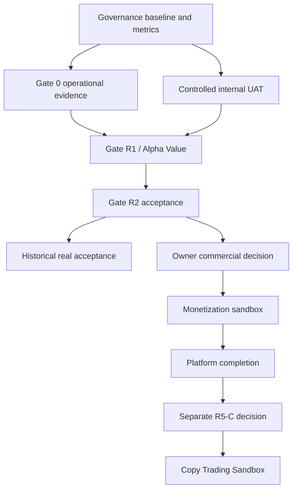

# Dependency Graph

| ID | التبعية | الحالة |
|---|---|---|
| DEP-01 | G1 قبل أي ادعاء بحالة مرحلة | CLOSED |
| DEP-02 | G0 recovery/evidence قبل Alpha رسمي | OPEN |
| DEP-03 | R1 UAT/reconciliation قبل Gate Value | OPEN |
| DEP-04 | Gate Value قبل قبول R2 النهائي | OPEN |
| DEP-05 | R2 قبل قرار R3-C | OPEN |
| DEP-06 | قرار R3-C مستقل قبل payment provider | HOLD |
| DEP-07 | G0/R1/R2/R3-C scope قبل إغلاق R4 الكامل | OPEN |
| DEP-08 | R4 closed وقرار security/legal قبل R5-C | HOLD |

المسارات التاريخية وWeb enablement موجودة كـ `BUILD_DONE`، لكن لا تكسر DEP-02 إلى DEP-08 ولا تمنح صلاحية للدفع أو التنفيذ.
