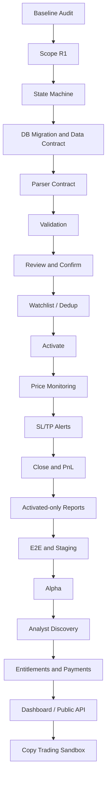

# Dependency Graph

## 1. الترتيب التنفيذي

## 2. Dependency Register

| ID | Task | Depends on | Blocking reason |
|---|---|---|---|
| DEP-01 | Scope R1 | Baseline audit | يمنع توسع النطاق غير المنضبط |
| DEP-02 | State machine | Scope R1 | كل query وevent يعتمد على الحالات |
| DEP-03 | PostgreSQL migration | State machine/data contract | يمنع اختلاف ORM عن schema |
| DEP-04 | Parser contract | State machine | يحدد payload الموحد |
| DEP-05 | Validation | Parser contract | لا يمكن Review موثوق دون payload صحيح |
| DEP-06 | Review/Confirm | Validation | لا يتم حفظ مدخل غير صالح |
| DEP-07 | Watchlist/Dedup | Review/Confirm + migration | يمنع duplicates قبل إنشاء UserTrade |
| DEP-08 | Activate | Watchlist state | لا يتحول إلى PnL قبل activation |
| DEP-09 | Monitoring | Activate + Redis/market feed | لا تنبيهات لصفقة غير مفعلة |
| DEP-10 | Close/PnL | Monitoring + lifecycle | لا report قبل close موثوق |
| DEP-11 | Reports | Close/PnL + reference dataset | تمنع أرقام مالية غير قابلة للتدقيق |
| DEP-12 | Alpha | E2E + Staging + recovery | لا مستخدمين حقيقيين قبل استقرار المسار |
| DEP-13 | Analyst discovery | Alpha/value proof | لا سوق قبل إثبات Retention |
| DEP-14 | Payments | Discovery/entitlements + legal | لا تحصيل قبل تعريف الاستحقاق والاسترداد |
| DEP-15 | Public API/Dashboard | Payments + tenant/security model | surface عامة تحتاج حدودًا ثابتة |
| DEP-16 | Copy Trading | Public platform + secrets + reconciliation | أموال حقيقية ممنوعة قبل sandbox/kill switch |

## 3. قواعد الاعتماد

يُسمح بتوازي مهام التوثيق والاختبارات غير المدمرة، لكن لا يُسمح بتوازي مهام تغيّر schema أو lifecycle إذا كانت تتنافس على نفس العقد. أي تغيير في State Machine يعيد فتح اختبارات Parser وReports وE2E.

إذا فشلت migration أو recovery، تتوقف المهام التابعة حتى معالجة السبب. إذا فشل E2E في Price Monitoring، لا ينتقل المشروع إلى Alpha حتى لو نجحت Unit tests.

## 4. المسار الحالي

الفرع الحالي أغلق `DEP-01` إلى `DEP-07` برمجيًا بدرجات متفاوتة، لكنه لم يغلق `DEP-03` تشغيليًا على PostgreSQL ولم يغلق `DEP-09` إلى `DEP-12` على Staging. لذلك الحالة الحالية هي **NO-GO للانتقال إلى Alpha، وR1 feature work مشروط بإغلاق Gate 0 التشغيلي**.
