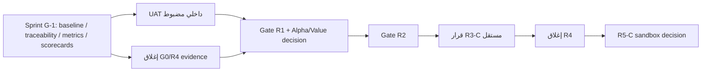

# CapitalGuard Pro v2 — Master Execution Baseline

**الإصدار:** 1.0  
**التاريخ:** 21 أغسطس 2026  
**الأساس البرمجي:** `origin/main` عند `f51cecd2641a4896df6766454bbf5a9a7d71e1a4` بعد PR #241.  
**قرار المالك:** تنفيذ Sprint G-1 لإعادة تأسيس الحوكمة قبل أي عمل منتجي جديد.

## 1. الغرض والحاكمية

هذه الوثيقة هي المرجع الحاكم لتسمية مراحل CapitalGuard وحالة بواباتها. لا تحل محل وثائق التصميم أو Runbooks؛ بل تمنع الخلط بين **وجود كود مدمج** و**إغلاق بوابة قبول**.

> لا تُستخدم أسماء R3 أو R4 أو R5 كتأكيد جاهزية تجارية أو تنفيذ مالي. كل بوابة تملك حالة بناء، وحالة دليل، وقراراً صريحاً مستقلاً.

## 2. مفردات الحالة الإلزامية

| الحالة | المعنى |
|---|---|
| `BUILD_DONE` | الكود والاختبارات المناسبة مدمجة، لكن الدليل التشغيلي أو قرار البوابة قد يبقى مفتوحاً. |
| `EVIDENCE_OPEN` | توجد مخرجات أو اختبارات، لكن دليل قبول خارجي أو قياس أو سجل تشغيل ناقص. |
| `GATE_CLOSED` | تحقق كل P0 والدليل والقرار الرسمي للبوابة. |
| `HOLD` | العمل أو التفعيل ممنوع عمداً حتى قرار أو شرط محدد. |
| `NOT_STARTED` | لا يوجد نطاق تنفيذي معتمد بعد. |

## 3. خريطة المسارات المصححة

| المعرف | الغاية | حالة البناء | حالة البوابة | الملاحظة الحاكمة |
|---|---|---|---|---|
| G0 | Railway Foundation & Stabilization | `BUILD_DONE` جزئياً | `EVIDENCE_OPEN` | Restore/RTO/RPO وexisting-data reconciliation وE2E خارجي غير مغلقة. |
| R1 | Trader Core | `BUILD_DONE` بدرجة كبيرة | `EVIDENCE_OPEN` | `/log` وlifecycle وreports موجودة، لكن UAT/p95/reference reconciliation/Alpha evidence غير مكتملة. |
| AV | Alpha / Value Proof | `NOT_STARTED` رسمياً | `EVIDENCE_OPEN` | لا cohort أو D7/activation/time-to-value مسجلة وفق العقد. |
| R2 | Trust & Analyst Discovery | `BUILD_DONE` بدرجة كبيرة | `EVIDENCE_OPEN` | يلزم قبول محلل حي ورصد 24–48 ساعة وretention/support evidence. |
| H1–H8 | Historical Trust Track | `BUILD_DONE` بدرجة كبيرة | `EVIDENCE_OPEN` | لا يعيد تسمية R3؛ يحتاج batch حقيقي وOHLCV وreview/replay/claim. |
| R3-C | Monetization Beta | `BUILD_DONE` للاستحقاقات المجانية فقط | `HOLD` | لا payment provider أو webhook أو refund أو reconciliation تجاري. |
| R4 | Platform Release | `BUILD_DONE` كـ Web/Control-Plane slice | `EVIDENCE_OPEN` | A-PG/Web/Read Models موجودة؛ tenant/API v1/rate limit/load/SLO/canary غير مغلقة. |
| R5-C | Copy Trading Sandbox | `NOT_STARTED` | `HOLD` | guardrails تمنع التنفيذ؛ لا تعتبر Sandbox أو Copy Trading. |

## 4. حدود المنتج غير القابلة للتفاوض

Core هو مصدر الحقيقة الوحيد للتوصيات والصفقات وPnL والأحداث التاريخية والنشر. Web PostgreSQL مخصصة للجلسات والتفضيلات والتدقيق الخاص بالويب، ولا تخزن سجلات مالية محلية. لا يفعّل أي PR `BILLING_ENABLED` أو `COPY_TRADING_ENABLED` أو `AUTO_TRADE_ENABLED` أو `TRADE_LIVE_ENABLED` أثناء `HOLD`.

السجل التاريخي لا ينشئ Recommendation أو UserTrade حية ولا يدخل Outbox أو Price Streamer. ويجب أن يبقى تصنيف الرسالة زمنياً واضحاً بين حي، حي متأخر، وإعادة بناء تاريخية وحدث مغلق.

## 5. ترتيب التنفيذ بعد Sprint G-1

لا يسمح هذا الرسم بالتسويق العام أو الدفع أو Copy Trading. وهو يوضح ترتيب الاعتماد فقط.

## 6. قواعد التغيير

كل PR جديد يذكر: `Baseline Requirement ID`، حالة البوابة المتأثرة، أثر البيانات والأمن والمقاييس، الاختبارات والدليل المطلوب، وخطة rollback. إذا غيّر PR حالة بوابة أو تعريف مقياس، يجب تحديث `Requirement_Traceability_Matrix.md` و`metrics_contract.md` و`GATE_SCORECARDS.md` في نفس PR أو في PR حوكمة مرتبط.

## المراجع

[1]: [`RAILWAY_FULL_EXECUTION_ROADMAP.md`](../RAILWAY_FULL_EXECUTION_ROADMAP.md)  
[2]: [`R5_READINESS_EVALUATION_20260821.md`](R5_READINESS_EVALUATION_20260821.md)  
[3]: [`CORE_WEB_READ_MODEL_CONTRACT.md`](CORE_WEB_READ_MODEL_CONTRACT.md)
